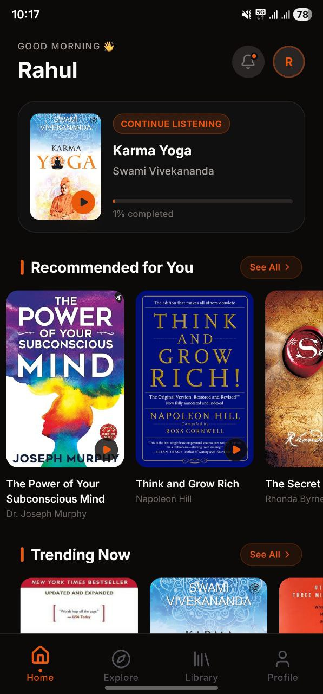
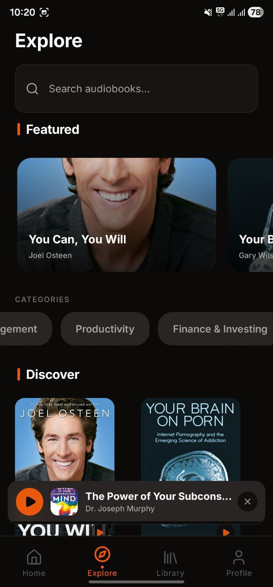
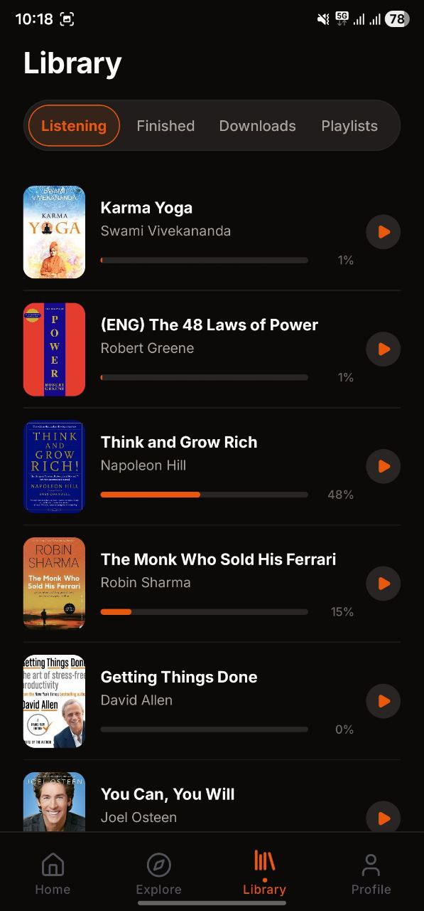
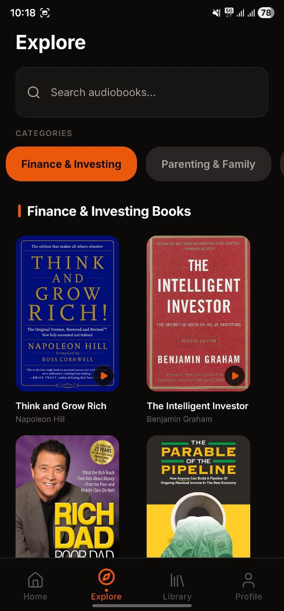
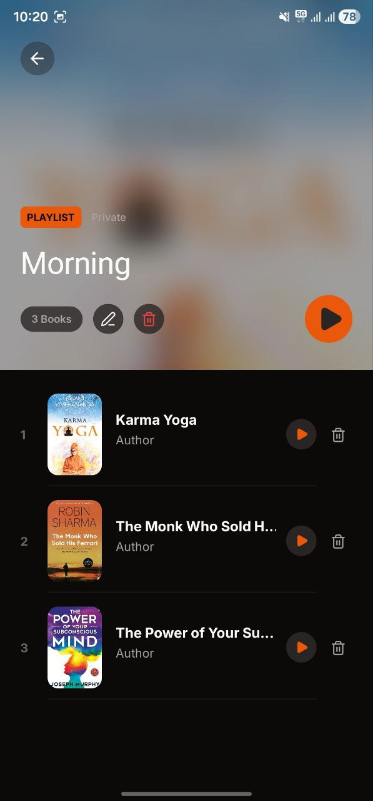

# Book Sync 📚

**Your Ultimate Audiobook Companion**

Book Sync is a premium, high-performance audiobook streaming and management application built with React Native and Expo. It offers a seamless, modern experience for discovering, listening to, and managing your personal audiobook collection.

## ✨ Features

- **Personalized Home Feed**: Tailored recommendations based on your listening habits.
- **Advanced Audio Player**: Full playback control with custom playback rates, seek forward/back (15s), and sleep timer.
- **Offline Mode**: Download your favorite audiobooks for listening anytime, anywhere without an internet connection.
- **Dynamic UI**: Beautiful, fluid animations powered by `react-native-reanimated` and a premium design system.
- **Social Interaction**: Like and comment on your favorite audiobooks.
- **Collection Management**: Organize books by categories, authors, and narrators.
- **Smart Seek**: Resume exactly where you left off, even across devices.
- **Update Notifications**: Stay up to date with the latest features through an in-app update indicator.

## 📥 Download

Get the latest version of Book Sync for your Android device:

- **Latest APK (GitHub)**: [Download APK](https://github.com/rahul-bhatt43/booksync-app/releases)

## 🚀 Tech Stack

- **Core**: React Native, Expo (SDK 54)
- **Styling**: NativeWind (Tailwind CSS for React Native)
- **Navigation**: Expo Router (File-based routing)
- **State Management**: React Context API
- **Networking**: Axios
- **Animations**: React Native Reanimated
- **Icons**: Lucide React Native, Expo Vector Icons
- **Fonts**: Google Fonts (Inter, Outfit)
- **Persistence**: React Native Async Storage

## 🛠️ Project Structure

```text
AudiobookApp/
├── app/                  # Expo Router directory (screens & layouts)
│   ├── (auth)/           # Authentication flows (welcome, login, etc.)
│   ├── (tabs)/           # Main tab-based navigation
│   ├── player/           # Dedicated audio player screen
│   └── collection.tsx    # Collection/Category view
├── components/           # Reusable UI components
├── contexts/             # React Contexts (Auth, Audio)
├── services/             # API and background services
├── constants/            # Design tokens & app constants
├── assets/               # Images, icons, and fonts
└── api/                  # API client configuration
```

## 🏁 Getting Started

### Prerequisites

- Node.js (v18 or higher)
- npm or yarn
- Expo Go app on your mobile device (or an emulator)

### Installation

1.  **Clone the repository**:
    ```bash
    git clone https://github.com/rahul-bhatt43/booksync-app.git
    cd booksync-app
    ```

2.  **Install dependencies**:
    ```bash
    npm install
    ```

3.  **Set up environment variables**:
    Create a `.env` file in the root directory and add your API base URL:
    ```env
    EXPO_PUBLIC_API_URL=https://your-api-endpoint.com
    ```

4.  **Start the development server**:
    ```bash
    npm run start
    ```

5.  **Run on a device/emulator**:
    - Press `a` for Android Emulator.
    - Press `i` for iOS Simulator.
    - Scan the QR code with the Expo Go app for physical devices.

## 📱 Visual Highlights

<p align="center">
  
  
  
</p>

<p align="center">
  
  
  
</p>

---

Designed with ❤️ for audiobook lovers.
